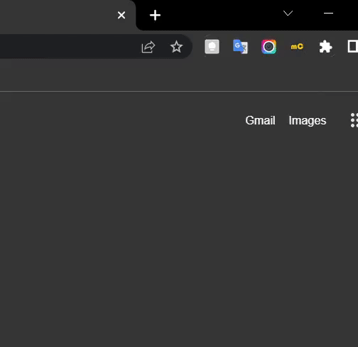

# ManoonChange

<p align="center">
  
</p>

This extension is made for my problem. It's because I can't install other keyboard layouts on the school's computer, which make me so annoying to type.

## Table of contents

- [Overview](#overview)
  - [Screenshot](#screenshot)
  - [Chrome web store links](#links)
- [My process](#my-process)
  - [Built with](#built-with)
  - [What I learned](#what-i-learned)

<br>

## Overview

### screenshot

### links

<br>

## My process

### Built with

- HTML
- CSS
- Javascript

### <strong>What I learned</strong>

**HTML**

- Use fake textarea instead, it more flexible.

-  
    ```html
    <input type="text" autofocus>
    ```

<br>

**CSS**

- 
    ```css
    :root{
        --myColor: red;
    }
    *{
        color:var(--myColor);
    }
- 
    ```css
    input:focus {
        text-decoration-line: underline;
        text-underline-offset: 10px;
    }
    ```
<br>

**Javascript**

- ```js
    textarea.value = "string"
    ```
- keyboard event
    ```js
    textarea.addEventListener("keypress",(event)=>{
        // check <enter> key
        if (event.key=="Enter"){
            return
        }
    })
    ```
    - for Backspace use "keydown" instead
        ```js
        textarea.addEventListener("keydown",(event)=>{
            if (event.key == "Backspace"){
                return
            }
        })
        ```
- copy to clipboard
    ```js
    function copy(){
        textarea.select()
        navigator.clipboard.writeText(textarea.value)
    }
    ```
- to export and import
    ```html
    <!-- index.html -->
    <script type"module" src="app.js">
    ```
    ```js
    // key.js
    export const myKeys = {key:"value"}
    ```
    ```js
    // app.js
    import { myKeys } from "./key.js"
    // don't forget '.js'
    ```
- set :root var
    ```js
    document.documentElement.style.setProperty('--myColor','black')
    ```
- [localStorage](https://developer.mozilla.org/en-US/docs/Web/API/Window/localStorage)
